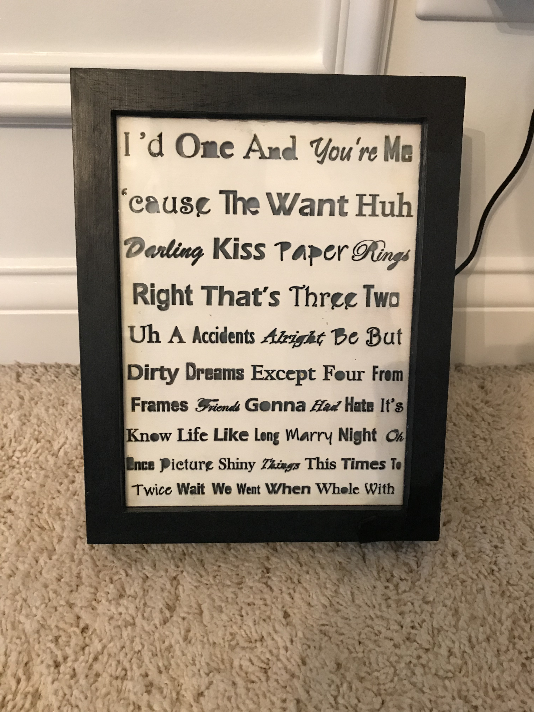
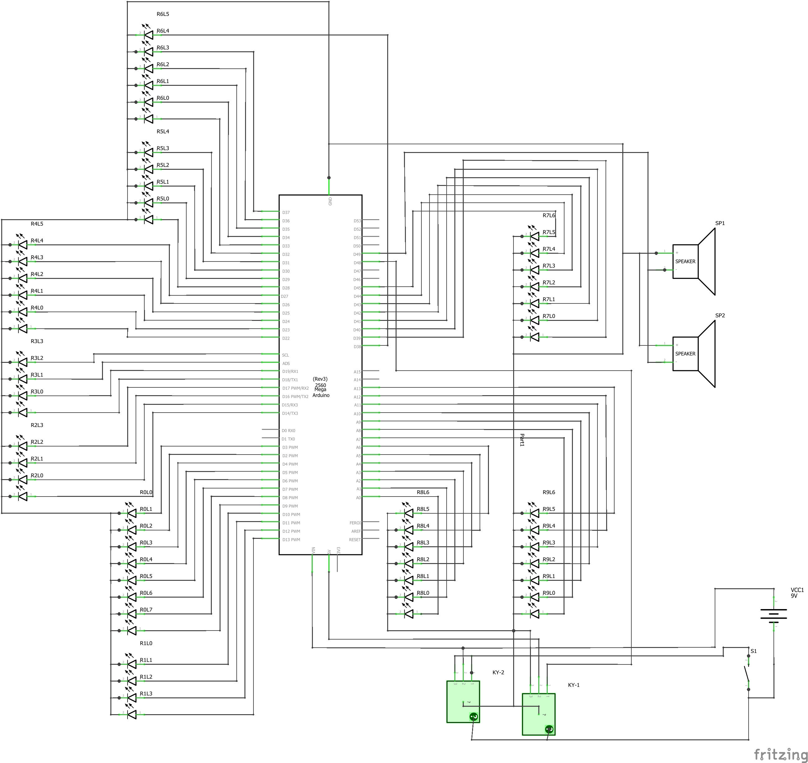
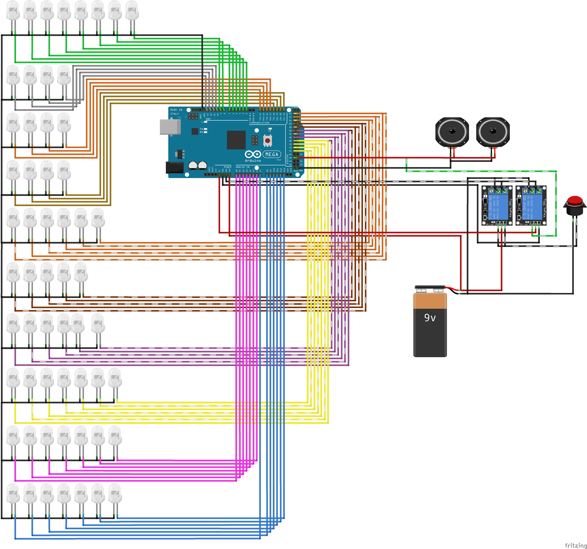
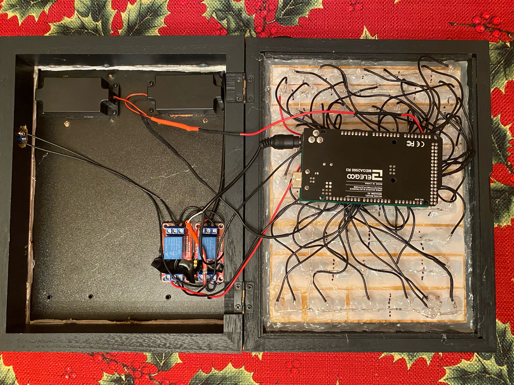

# Word Frame Music Box

## Description

This project was made as a Christmas gift for Christmas 2020. The goal was to create a picture frame box that would play the song *"Paper Rings"* by Taylor Swift and light up the lyrics as they were sung. This was accomplished using an Arduino Mega microcontroller to both play the music and control th LEDs. The main notable concession that was made was in the audio. The song had to be played as beep tones as the arduino was not able to properly play audio files.

## Hardware Used

- Arduino Mega microcontroller
- 5mm White LEDs
- Shadow Box Frame
- 2 x 3 Watt 8 Ohm Speakers
- 2 x 5 VDC relays
- Push Button
- Msc. other materials (glue, screws, wire, etc.)
    
## Software

Unfortunately, the final version of the sketch has been lost. The laptop that was used to write the program was wiped; only an 8 hour behind backup (*Xmas2020v1.ino*) now exists. While this backup is incomplete, it still shows the underlying algorithm that was used. The arduino IDE was used to write and upload the sketch to an Arduino Mega via a USB connection. The Arduino IDE can be found on the official [Arduino website](https://www.arduino.cc/en/software "Arduino IDE Download page").  
Fortunately, the final sketch still exists in the finished project.  Unfortunately, this also means that it is not possible to replicate or make any changes to the project.

## Installation

As mentioned in the previous section; since the final sketch file was lost, 
there is currently no way to replicate the end result of this project. 
The backup can be uploaded and if this project gets reworked at a later date, 
the process will be the same.

1. Download and install the Arduino IDE 
[here](https://www.arduino.cc/en/software "Arduino IDE Download page")
1. Download the *Xmas2020v1.ino* file and place it in a folder called *Xmas2021*
 inside the Arduino sketch folder (*this by default is located in "Documents"*)
1. Connect an Arduino Mega to the computer via a USB A to USB B cable.
1. Verify that the device is connected by checking to see if a new Serial device appeared in the 
 **Tools>Port** Navigation menu. Select the new device.
1. Click the **Verify** checkmark button located under **File**.
 If there are no errors and the sketch successfully verifies, click the **Upload** button.
1. Open the serial monitor located in either the **Tools** navigation menu 
or by clicking the **Serial Monitor** magnifying glass button in the far left

## Imagery

### Finished Project ###

### Project Schematic ###

### Board Diagram ###

### Finished Internals ###

### Demo ### 

https://user-images.githubusercontent.com/97221507/150666107-9c51fa00-3f60-487e-b866-e35694e0d3b7.mp4

## Roadmap

At this time, there is no active work being done on this project. 
That being said, there are a few different things that may be explored in the future.

- rewrite/refinish the project sketch
- add a dedicated audio amp and an SD card reader to actually play the song instead of beep tones
- create a different version using different songs
- adapt the project to work with any song

Some of these are much larger undertaking than others but this project can work as a basis for later work.

## Authors & Acknowledgments

All the code, construction, and debugging done by Jason Hampshire

Thanks to [Tate's Laser Engraving](https://business.facebook.com/tateslaser/) for the faceplate of the music box

Special thanks also to Maddie, for whom this project was made for

The song is owned by Taylor Swift; I make no claims to it and this project is not intended for profit or commercial use.

## Project Status

This project is currently **Closed** with the potential to be reopened  at a later date
